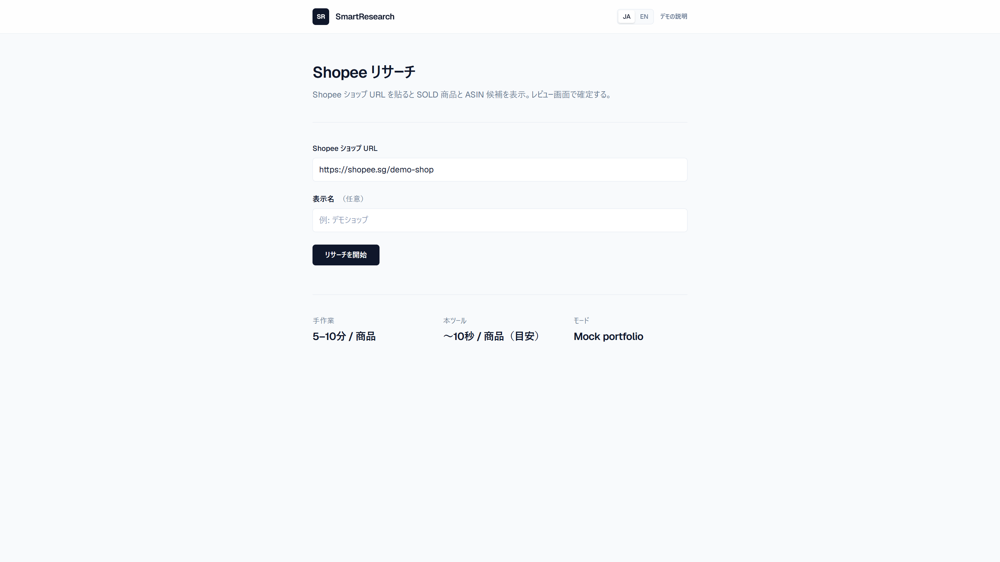
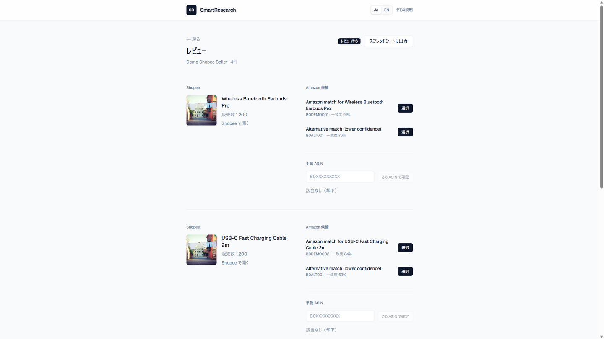

# SmartResearch-HQ

[](https://smart-research-hq.vercel.app)
[](https://github.com/hrn-dev-work)

Public markdown conventions: [docs/doc-conventions.md](docs/doc-conventions.md).

Japanese: see below.

Cross-border EC research tool: take a Shopee shop URL, list SOLD items, propose Amazon ASIN candidates, confirm on a review screen, optionally export. One monorepo with **Portfolio** (public Mock demo) and **Production** (private scrape / match / Sheets).

Manual matching often takes **5–10 minutes per item**. The UI targets a short review pass instead. Matching is pluggable; default production path is Amazon PA-API title search (Gemini is optional, not required).

---

## Why two modes in one codebase

| Mode | Audience | Runtime |
|------|----------|---------|
| **Portfolio** (this demo) | Recruiters, clients, reviewers | In-memory Mock — no Postgres, Redis, or API keys |
| **Production** (private ops) | Real cross-border EC workflows | Playwright scraping, Redis + ARQ workers, pluggable matching (PA-API / Gemini), Google Sheets |

`APP_MODE` switches behavior on the same FastAPI + Next.js app. Portfolio keeps the full UI path (research → review → export counts) without secrets. Production adds workers and live integrations.

Header link **About this demo** explains the split (JA / EN). Soft Paper UI tokens: [docs/design/brief.md](docs/design/brief.md).

---

## Screenshots

Live demo: [smart-research-hq.vercel.app](https://smart-research-hq.vercel.app)

**Dashboard** — shop URL → start research



**Review** — Amazon candidates and manual ASIN



Short walkthrough (dashboard → review): [docs/videos/portfolio-demo.webm](docs/videos/portfolio-demo.webm)

Demo product thumbnails live under `frontend/public/demo/` (served as `/demo/*.png`).

---

## Tech stack

Org policy: **[docs/tech-stack-policy.md](docs/tech-stack-policy.md)** (this repo = **Profile B** — FastAPI pipeline). New business SaaS repos use **Profile A** (Laravel).

*   **Frontend:**   
*   **Backend:**  
*   **Portfolio infra:**  
*   **Production infra:**   

---

## Quick start (local, portfolio)

Postgres and Redis are **not** required.

```bash
bash scripts/bootstrap-local.sh

# Terminal 1 — API
cd backend && source .venv/bin/activate
uvicorn app.main:app --reload --port 8000

# Terminal 2 — UI
cd frontend && npm run dev
```

Open http://localhost:3000 → enter a Shopee shop URL → review candidates → export.

Health: `GET http://localhost:8000/api/v1/health` → `{ "status": "ok", "mode": "portfolio", ... }`

---

## Quick start (local, production — private)

**Not deployed publicly.** Requires Docker (Postgres + Redis), Playwright, and optionally Amazon PA-API keys. Gemini is optional.

```bash
bash scripts/start-production-local.sh
# Edit .env: APP_MODE=production, AMAZON_PAAPI_* (see docs/production-local-setup.md)
```

Full checklist: **[docs/production-local-setup.md](docs/production-local-setup.md)** · M2 smoke: `bash scripts/smoke-m2.sh`

---

## Deploy (portfolio)

1. Apply [render.yaml](render.yaml) on Render (`APP_MODE=portfolio`).
2. Deploy `frontend/` to Vercel; set `NEXT_PUBLIC_API_URL` to your Render API base + `/api/v1`.
3. Set `ALLOWED_ORIGINS` on Render to your Vercel URL(s).

Full checklist: **[docs/deployment-guide.md](docs/deployment-guide.md)**  
Troubleshooting (404, CORS, CLI): **[docs/deployment-troubleshooting.md](docs/deployment-troubleshooting.md)**

One-command redeploy: `bash scripts/portfolio-vercel-deploy.sh redeploy`

---

## Repository layout

```
├── docs/           # Design & architecture
├── frontend/       # Next.js dashboard & review UI
├── backend/        # FastAPI (Mock services in portfolio mode)
├── render.yaml     # Render Blueprint (portfolio API)
├── docker-compose.yml
└── scripts/        # bootstrap, CI, smoke tests
```

---

## Documentation

| Doc | Contents |
|-----|----------|
| [CONTEXT.md](CONTEXT.md) | Domain glossary, security & engineering guardrails |
| [Agent index](docs/agents/README.md) | Security, YAGNI/fail-fast/testability, ADR index |
| [Project plan](docs/プロジェクト計画書.md) | Goals & scope |
| [Architecture](docs/architecture.md) | Two-mode design, data flow |
| [Design](docs/design.md) | UI principles |
| [API specification](docs/api-specification.md) | REST contract |
| [Deployment guide](docs/deployment-guide.md) | Vercel / Render env vars |
| [Tech stack policy](docs/tech-stack-policy.md) | Org Must/Choose; this repo = Profile B |
| [Security scanning](docs/security-scanning.md) | CI secret/CodeQL guardrails |
| [Doc conventions](docs/doc-conventions.md) | English → `---` → Japanese for public md |
| [Git hooks](docs/git-hooks.md) | Local pre-commit / post-push install |

---

## Development

### Prerequisites

| Item | Notes |
|------|-------|
| OS | **WSL Ubuntu** recommended on Windows (avoid Git Bash + UNC paths) |
| Python | 3.12 |
| Node.js | 20 LTS |
| Docker | Optional — production verification only |

```bash
bash scripts/ci-check.sh   # Ruff + pytest + ESLint + build (mirrors CI)
```

Optional — install tracked git hooks (secret scan + doc validation on commit):

```bash
bash scripts/install-git-hooks.sh
```

See [docs/git-hooks.md](docs/git-hooks.md).

Production verification (optional): copy `.env.example` → `.env`, then `docker compose up -d postgres redis` with `APP_MODE=production`.

### Key environment variables (portfolio)

| Variable | Where | Description |
|----------|-------|-------------|
| `APP_MODE` | Backend | `portfolio` (Mock) or `production` |
| `NEXT_PUBLIC_API_URL` | Frontend | API base URL, e.g. `http://localhost:8000/api/v1` |
| `ALLOWED_ORIGINS` | Backend | Comma-separated CORS origins for deployed frontend |

See `.env.example` for production-only variables (PA-API, Gemini, Sheets).

---

## Roadmap

- [x] Phase 1 — Design, monorepo, docs
- [x] Phase 2 — Scraping, matching, Sheets, workers
- [x] Phase 3 — Job polling, manual ASIN UI
- [x] Phase 4 — Portfolio deploy, Soft Paper UI, screenshots / demo video

---

## License

Private / portfolio use. The portfolio edition omits scraping internals and proprietary prompts.

---

# SmartResearch-HQ（日本語）

**[デモアプリ](https://smart-research-hq.vercel.app)** — 公開ポートフォリオ（Vercel + Render、`APP_MODE=portfolio`）

越境 EC のリサーチツール。Shopee ショップ URL から SOLD を集め、Amazon ASIN 候補を出し、レビューで確定し、必要なら Sheets へ出す。**Portfolio**（公開 Mock）と **Production**（非公開のスクレイプ / マッチ / Sheets）を同一モノレポで持つ。

手作業の名寄せは商品あたり **5–10 分**かかりがち。UI はその作業を短いレビューに寄せる。マッチングは差し替え可能で、本番の既定は Amazon PA-API タイトル検索（Gemini は任意）。

---

## なぜ 1 コードベースで二つのモードか

| モード | 想定利用者 | 実行時 |
|--------|------------|--------|
| **Portfolio**（本デモ） | 採用担当・クライアント・レビュアー | インメモリ Mock — Postgres / Redis / API キー不要 |
| **Production**（非公開運用） | 実際の越境 EC 業務 | Playwright スクレイピング、Redis + ARQ ワーカー、プラガブルマッチング（PA-API / Gemini）、Google Sheets |

`APP_MODE` で同じ FastAPI + Next.js の挙動を切り替える。Portfolio はリサーチ → レビュー → エクスポート件数までを秘密情報なしで見せる。Production はワーカーと外部連携を足す。

ヘッダーの **「このデモについて」** で表／裏の説明（JA / EN）。UI トークン: [docs/design/brief.md](docs/design/brief.md)（Soft Paper）。

---

## スクリーンショット

公開デモ: [smart-research-hq.vercel.app](https://smart-research-hq.vercel.app)

**ダッシュボード** — ショップ URL → リサーチ開始


**レビュー** — Amazon 候補と手動 ASIN


短い操作動画（ダッシュボード → レビュー）: [docs/videos/portfolio-demo.webm](docs/videos/portfolio-demo.webm)

デモ用サムネイルは `frontend/public/demo/`（URL は `/demo/*.png`）。

---

## 技術スタック

組織方針: **[docs/tech-stack-policy.md](docs/tech-stack-policy.md)**（本リポ = **プロファイル B** — FastAPI パイプライン）。新規業務 SaaS は **プロファイル A**（Laravel）。

- **フロント:** Next.js 16、TypeScript、Tailwind CSS
- **バックエンド:** FastAPI、Pydantic v2
- **Portfolio インフラ:** Vercel（UI）+ Render（API）— [デプロイ手順](docs/deployment-guide.md)
- **Production インフラ:** PostgreSQL 16、Redis 7、Playwright、Google Sheets API

---

## クイックスタート（ローカル・portfolio）

Postgres と Redis は **不要** です。

```bash
bash scripts/bootstrap-local.sh

# ターミナル 1 — API
cd backend && source .venv/bin/activate
uvicorn app.main:app --reload --port 8000

# ターミナル 2 — UI
cd frontend && npm run dev
```

http://localhost:3000 を開く → Shopee ショップ URL を入力 → 候補をレビュー → エクスポート。

ヘルス: `GET http://localhost:8000/api/v1/health` → `{ "status": "ok", "mode": "portfolio", ... }`

---

## クイックスタート（ローカル・production — 非公開）

**公開デプロイはしていません。** Docker（Postgres + Redis）、Playwright、必要に応じて Amazon PA-API キーが必要です。Gemini は任意です。

```bash
bash scripts/start-production-local.sh
# .env を編集: APP_MODE=production, AMAZON_PAAPI_*（docs/production-local-setup.md 参照）
```

チェックリスト: **[docs/production-local-setup.md](docs/production-local-setup.md)** · M2 スモーク: `bash scripts/smoke-m2.sh`

---

## デプロイ（portfolio）

1. Render で [render.yaml](render.yaml) を適用（`APP_MODE=portfolio`）。
2. `frontend/` を Vercel にデプロイ。`NEXT_PUBLIC_API_URL` に Render API のベース + `/api/v1` を設定。
3. Render の `ALLOWED_ORIGINS` に Vercel の URL を設定。

手順: **[docs/deployment-guide.md](docs/deployment-guide.md)**  
障害対応（404、CORS、CLI）: **[docs/deployment-troubleshooting.md](docs/deployment-troubleshooting.md)**

ワンコマンド再デプロイ: `bash scripts/portfolio-vercel-deploy.sh redeploy`

---

## リポジトリ構成

```
├── docs/           # 設計・アーキテクチャ
├── frontend/       # Next.js ダッシュボード・レビュー UI
├── backend/        # FastAPI（portfolio 時は Mock）
├── render.yaml     # Render Blueprint（portfolio API）
├── docker-compose.yml
└── scripts/        # bootstrap、CI、スモークテスト
```

---

## ドキュメント

| ドキュメント | 内容 |
|--------------|------|
| [CONTEXT.md](CONTEXT.md) | ドメイン用語・セキュリティ・工学原則 |
| [エージェント索引](docs/agents/README.md) | セキュリティ、YAGNI/フェイルファスト/テスト、ADR |
| [プロジェクト計画書](docs/プロジェクト計画書.md) | 目的・スコープ |
| [アーキテクチャ](docs/architecture.md) | 二刀流設計・データフロー |
| [設計書](docs/design.md) | UI 原則 |
| [API 仕様](docs/api-specification.md) | REST 契約 |
| [デプロイ手順](docs/deployment-guide.md) | Vercel / Render の環境変数 |
| [技術スタック方針](docs/tech-stack-policy.md) | 組織 Must/Choose、本リポ = プロファイル B |
| [セキュリティスキャン](docs/security-scanning.md) | CI secret / CodeQL ガードレール |
| [ドキュメント規約](docs/doc-conventions.md) | 公開 md の英語 → `---` → 日本語 |
| [Git フック](docs/git-hooks.md) | ローカル pre-commit / post-push の導入 |

---

## 開発

### 前提環境

| 項目 | 備考 |
|------|------|
| OS | Windows では **WSL Ubuntu** 推奨（Git Bash + UNC パスは避ける） |
| Python | 3.12 |
| Node.js | 20 LTS |
| Docker | 任意 — production 検証時のみ |

```bash
bash scripts/ci-check.sh   # Ruff + pytest + ESLint + build（CI と同等）
```

任意 — Git フック（pre-commit チェック + post-push PR 同期）: `bash scripts/install-git-hooks.sh` — [docs/git-hooks.md](docs/git-hooks.md) を参照。

Production 検証（任意）: `.env.example` → `.env` をコピーし、`APP_MODE=production` で `docker compose up -d postgres redis`。

### 主な環境変数（portfolio）

| 変数 | 設定先 | 説明 |
|------|--------|------|
| `APP_MODE` | バックエンド | `portfolio`（Mock）または `production` |
| `NEXT_PUBLIC_API_URL` | フロント | API ベース URL（例: `http://localhost:8000/api/v1`） |
| `ALLOWED_ORIGINS` | バックエンド | デプロイ先フロントの CORS origin（カンマ区切り） |

Production 専用の変数（PA-API、Gemini、Sheets）は `.env.example` を参照。

---

## ロードマップ

- [x] Phase 1 — 設計、モノレポ、docs
- [x] Phase 2 — スクレイピング、マッチング、Sheets、ワーカー
- [x] Phase 3 — ジョブポーリング、手動 ASIN UI
- [x] Phase 4 — Portfolio デプロイ、Soft Paper UI、スクショ / デモ動画

---

## ライセンス

Private / portfolio 利用。Portfolio 版ではスクレイピング内部やプロプライエタリなプロンプトは含みません。
