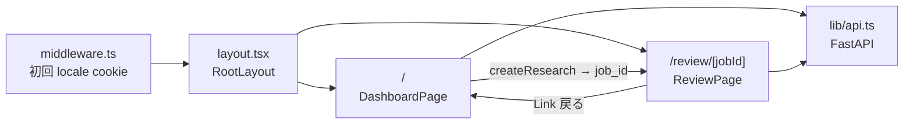
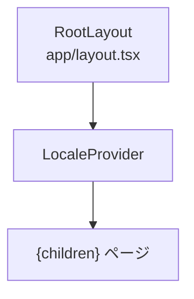
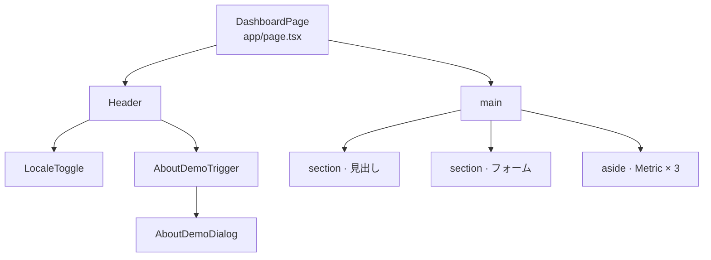
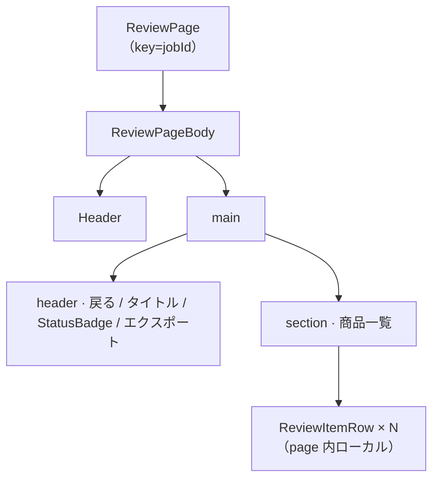
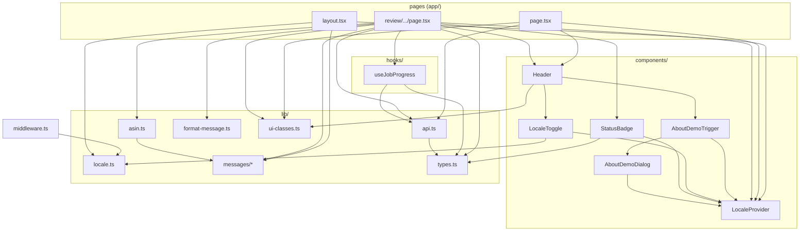
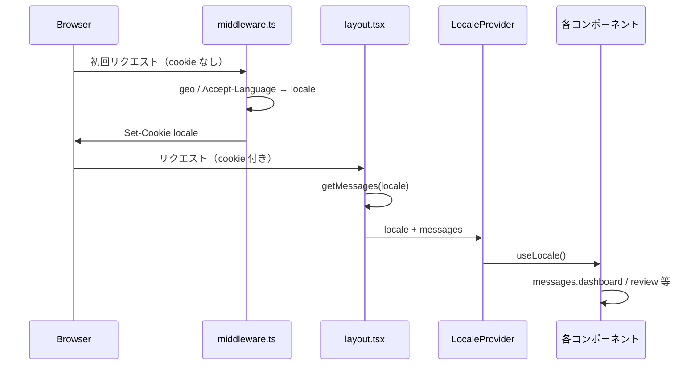

# フロントエンド構造（Next.js App Router）

コードベースの画面・コンポーネント・依存関係の地図（Mermaid）。

- **概要・利点・使い方**: [frontend-structure-guide.md](./frontend-structure-guide.md)
- **日常のレイヤー確認**: [React DevTools](https://react.dev/learn/react-developer-tools)（Components タブ）

> **更新タイミング**: ルート追加、`components/` 新規、主要な lib 分割時に §2〜§4 を見直す。

---

## 1. 画面遷移



| ルート | ファイル | 役割 |
|--------|----------|------|
| `/` | `app/page.tsx` | Shopee URL 入力 → リサーチ開始 |
| `/review/[jobId]` | `app/review/[jobId]/page.tsx` | ジョブ進捗・ASIN 候補レビュー・エクスポート |

---

## 2. コンポーネントツリー（Figma Layers 相当）

### 2.1 共通ラッパー



### 2.2 `/` ダッシュボード



`Metric` は `page.tsx` 内のローカルコンポーネント（未共有化）。

### 2.3 `/review/[jobId]` レビュー



---

## 3. モジュール依存（import 関係）



---

## 4. 多言語（i18n）



- 辞書: `lib/messages/ja.ts`, `en.ts`
- Cookie 書き込み: `lib/locale.ts`（`LocaleToggle` 経由）および `middleware.ts`（初回のみ）
- 詳細: [design.md §2.6](./design.md)

---

## 5. ディレクトリ早見表

```
frontend/src/
├── app/
│   ├── layout.tsx              # RootLayout + LocaleProvider
│   ├── page.tsx                # / ダッシュボード
│   └── review/[jobId]/page.tsx # レビュー
├── components/
│   ├── Header.tsx
│   ├── StatusBadge.tsx
│   ├── LocaleProvider.tsx
│   ├── LocaleToggle.tsx
│   ├── AboutDemoTrigger.tsx
│   └── AboutDemoDialog.tsx
├── hooks/
│   └── useJobProgress.ts       # ジョブポーリング
├── lib/
│   ├── api.ts                  # REST クライアント
│   ├── asin.ts                 # ASIN バリデーション
│   ├── locale.ts
│   ├── format-message.ts
│   ├── ui-classes.ts           # 共通 Tailwind クラス
│   ├── types.ts
│   └── messages/               # ja / en 辞書
└── middleware.ts               # 初回 locale 判定
```

---

## 6. ローカルでの確認手順

1. `bash scripts/bootstrap-local.sh` で API + UI 起動
2. Chrome [React Developer Tools](https://react.dev/learn/react-developer-tools) → **Components** タブ
3. `/` と `/review/{任意の jobId}` でツリーを比較

構造変更後は本ファイルの Mermaid を先に更新し、実 DOM と DevTools 表示が一致するか確認する。
